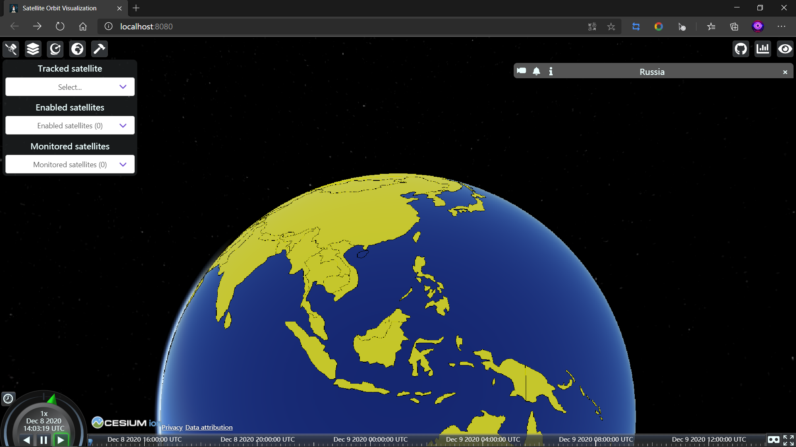

# 基于cesium平台的卫星轨迹可视化
## 前端配置：
[cesium中文教程](http://cesium.xin/wordpress/archives/all-article.html)

>官网下载安装Node.js,之后跳转至satvis目录，国内下载速度慢换用阿里的镜像
```
npm config set registry https://registry.npm.taobao.org 
npm install
```

>克隆.gitmodules中的子模块,最后运行：
```
git submodule update --init --recursive
npm run start
```
效果：

<br /><br />

## 后端配置：
>最好新建python虚拟环境Venv操作,跳转至satvis_api中
```
pip install -r ./requirements.txt
python app.py
```
效果：
