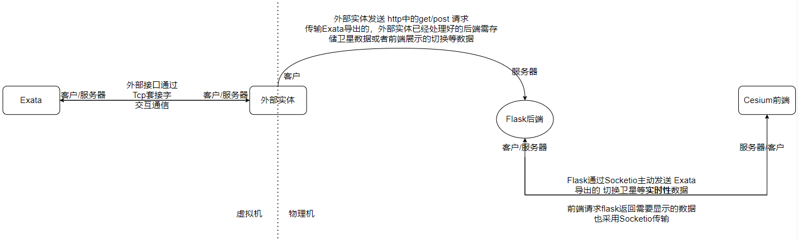

# 基于Cesium平台显示的Exata卫星轨迹可视化
<br />

>*原工程：https://github.com/Flowm/satvis*  
在前工程基础修改及备忘记录在[修改日志.md](mydata/修改日志_lk.md)中  

>整个项目的消息流程图使用开源软件[DrawIO](https://app.diagrams.net/index.html)绘制,[切换流程文件](mydata/切换流程.drawio)可以使用DrawIO网站直接打开。    
<center>  


</center> <br /><br />

## 前端配置：
>[cesium中文教程](http://cesium.xin/wordpress/archives/all-article.html)  

>官网下载安装Node.js,之后跳转至satvis目录, cd ./satvis  
国内下载速度慢换用阿里的镜像
```
npm config set registry https://registry.npm.taobao.org 
npm install
```

>克隆.gitmodules中的cesium-assets子模块,最后运行：
```
git submodule update --init --recursive
npm run start
```
### 运行效果预览：

<br /><br /><br /><br />


## 后端配置：
>跳转至satvis_api中  cd ./satvis_api  ，`最好新建python虚拟环境Venv操作`。  
我使用的是python3自带的venv模块,即 python3 -m venv venv  
第三方依赖包记录于[requirements.txt](satvis_api/requirements.txt)  
python运行版本为3.8
```
pip install -r ./requirements.txt
python app.py
```
>环境配置完成后可以直接执行[start_flask脚本](start_flask.ps1)来运行flask  
启动虚拟环境并启动flask (虚拟文件夹为venv且路径在satvis_api内根目录此脚本才生效)
### 运行效果预览：
