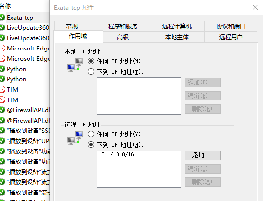
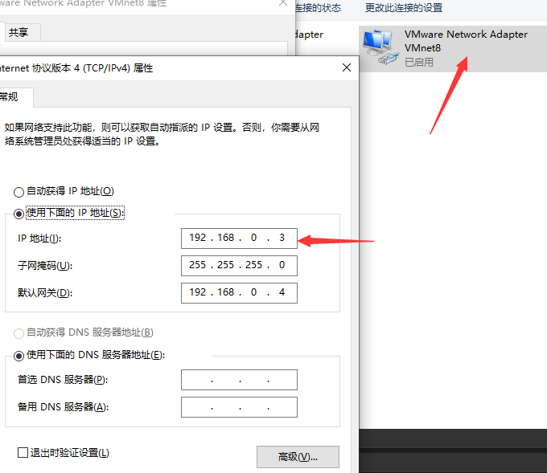

# 修改记录日志

## 2020/12/16
1. 建立python与Exata外部接口数据的http连接，文件之后存储于mydata中，通信flask IP地址为其形参，默认不输入为10.16.43.47
2. Exata虚拟机无法与物理机同一局域网内的其他机器通信问题
    + 首先确保虚拟机网络编辑器为桥接至物理机，虚拟机类似于一台主机与物理机在同一局域网内(此处为10.16.0.1/16子网)。
    + 防火墙开启ICMPV4后可以使用ping物理主机IP地址来测试是否在同一局域网。
    + 物理机和虚拟机的防火墙关闭(记住日常使用要及时开启)`或者`编辑虚拟机和物理机防火墙入站规则:设置tcp、端口、IP子网规则通信等（要确保远程IP地址子网包含虚拟机本地IP）
    +
    
3. 其实若是虚拟机内数据发到当前物理机，虚拟机使用默认的NAT格式即可，不需要设置防火墙。Exata tcp通信地址改为VMware Network Adapt8虚拟网卡设置的的静态IP地址（当然ping物理机物理地址也可，但是校园网内的物理机IP经常会变）
    

4. flask主函数修改为广播
```
    if __name__ == '__main__':
    app.run(debug=True, host='0.0.0.0', port='5000')
```
## 2020/12/19
1. 暂时性添加返回接受get post路由信息函数仿照此get、post请求的[抓包信息](/mydata/test_get_post)模拟了一个http请求的函数
2. 与原Exata套接字导出数据部分融合,中间测试用的get、post文件请求也放在上面介绍的目录中

## 2020/12/23
1. 明确Vue与后端的exata数据交互方式，记录于[切换流程文件](./切换流程.drawio)中
2. 给Node.js及python添加socketio模块，使得后端可以主动发送数据给前端 

```
nodejs: npm install socket.io --save
python: pip install flask-socketio
```

## 2021/1/23
1. Exata的lte切换导入flask后端测试成功，现对接前端交互测试。后端flask已经可以与前端vue建立通信，测试是否将数据导入切换动画效果中
2. 暂定exata使用get传输切换等命令，post传输相关数据。flask发送给cesium的各项初始化数据记录在[initialize](/satvis_api/initialize.json)中
3. 测试中发现vue-socket.io版本虽然为3.0.10但其对应内核为js的2.X的socketio，所以要将flasksocketio和pythonsocketio版本降到4.x才可以正常交互

## 2021/1/26
1. 完善cesium与exata联动时同步过程，添加了开始、结束仿真以及系统初始化信令。(改变cc.viewer参数)确保Exata仿真前cesium保持时间运动轨迹不变直到exata仿真运行后cesium才会调用json里的初始化参数。
2. 尝试原保存在sessionStorage的dst数据转为其他js调用的全局变量

## 2021/2/4
1. 继续使用sessionStorage，之后多终端改数据格式后再改变。
2. 设置SatelliteManager.js默认启用以下数据，地面终端问题设置问题先搁置待解决
```
this.enabledComponents = ["Point", "Label", "Orbit", "Ground station link"];
```
3. pythona安装eventlet包，导致falsk收到http访问返回消息后不会立刻关闭该套接字，所以不针对复杂场景的外部实体接收返回代码更改为仅接收一次就主动关闭tcp套接字。
4. 之后任务中Exata加入48星场景测试，传输其中信令数据仅仅后端存储不展示至Cesium。

## 2021/2/25
1. 编写完毕已Exata实现信令，完成接口手册，待调试成功后尝试将数据导入后端
2. falsk处理接收数据结构不适用if else，使用仿照switch方式：
```
def Season1():
    return "Spring"
def Season2():
    return "Summer"
def Season3():
    return "Fall"
def Season4():
    return "Winter"
def Default():
    return "Invalid Season"
seasondict = {
    1: Season1,
    2: Season2,
    3: Season3,
    4: Season4
}

def getSeason(season):
    """
    将season映射为字符串
    :param season:
    :return:
    """
    fun = seasondict.get(season, Default)
    return fun()
```

## 2021/4/25
1. 简化流程，外部接口不再传输每条详细信令，而是封装成指令和关键数据源传输给flask。
2. 整合师兄前端代码，其实现功能汇总：
    - 实现cesium设定固定时间、倍速显示仿真效果
    - 展示卫星选择核心网信令展示界面
    - 简易单个终端切换效果